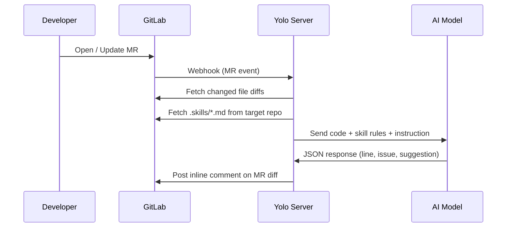

# Yolo AI Reviewer

**Automated AI code review for GitLab Merge Requests.**

Yolo listens to GitLab webhooks, analyzes changed code using an AI model, and posts inline comments directly on the MR diff — acting as an automated, tireless code reviewer.

## Features (Priority 1)

- 🚀 **Interactive CLI Setup:** Generate configurations instantly using the built-in CLI prompt.
- 🧠 **AI Agnostic:** Supports OpenAI, Anthropic, Gemini, or any custom local LLMs (like Ollama).
- 🛡️ **Context-Aware Rules:** Reads your `.skills/` folder to apply repository-specific standards (e.g., security, clean code).
- 🔄 **Auto-Resolve Threads:** Automatically resolves old AI comments in GitLab if you have fixed the code in subsequent commits.
- 🚫 **Anti-Spam:** Cryptographic hashing prevents the AI from posting duplicate comments on the same issues.
- ⚡ **Hot-Reloading Config:** Adjust system behaviors dynamically without restarting the server.

---

## How It Works



---

## Requirements

- [Bun](https://bun.sh) v1.0+
- GitLab instance (self-hosted or gitlab.com)
- An OpenAI-compatible AI proxy (`/v1/chat/completions` endpoint)

---

## Setup

### 1. Initialization

Yolo comes with a built-in interactive CLI prompt to help you set up the environment variables and configuration file instantly. You can initialize it anywhere using `npx`:

```bash
npx yolo init
# or
bunx yolo init
```

*(Note: If you are running directly from this source code locally, use `bun run src/cli/index.ts` instead).*

Follow the interactive prompt to configure your:
1. GitLab credentials & Webhook secret
2. Preferred AI provider (OpenAI, Anthropic, Gemini, or Custom)
3. AI parameters (Model, Temperature, Top-P)
4. AI Response Language (English or Indonesian)

Once finished, it will automatically generate `.env` and `config.yml` at the root of your project.

### 2. Run

Start the development server:
```bash
bun dev
```

Server starts on `http://localhost:3000` (or the port you defined).

### 3. Register Webhook in GitLab

To connect Yolo to your repository, set up a webhook:
1. Go to your GitLab project (or group).
2. Navigate to **Settings** → **Webhooks**.
3. Fill in the form:
   - **URL**: `https://your-server-or-tunnel.com/webhook/gitlab` (Use ngrok or Cloudflare Tunnel if testing locally).
   - **Secret token**: Paste the exact string you set in `GITLAB_WEBHOOK_SECRET` inside your `.env` file.
4. Under **Trigger**:
   - ❌ Uncheck *Push events*
   - ✅ Check **Merge request events**
5. Click **Add webhook**.

You can verify the connection by clicking **Test** → **Merge request events** in GitLab. You should immediately see a log appear in your Yolo server terminal.

---

## Adding Skill Rules to Your Target Repos

Yolo fetches review guidelines directly from the repository being reviewed. Create a \`.skills/\` folder at the root of your target project:

```text
your-project/
└── .skills/
    ├── security.md
    ├── performance.md
    └── clean-code.md
```

Each \`.md\` file contains plain-text rules in any format you prefer. All files in \`.skills/\` are merged and sent to the AI as review standards dynamically.
If \`.skills/\` is empty or missing, Yolo will fallback to general code review standards.

**Example \`security.md\`:**

```markdown
- Never hardcode credentials, tokens, or API keys
- Always validate and sanitize user input before processing
- Avoid exposing internal error details in API responses
```

---

## Configuration

All system instructions and behaviors live in `config.yml`. This file is automatically generated for you during the `npx yolo init` setup.

Once generated, you can open `config.yml` to further customize the system prompts, output formats, and AI behaviors (such as `confidence_threshold`, `responseLanguage`, etc.).

```yaml
skillsPath: ".skills"
responseLanguage: "English"
features:
  autoResolve: true
# ... and more
```

### Hot-Reloading

Changes to `config.yml` are picked up immediately while the server is running — no restart needed. The AI's prompt is built dynamically based on this file and the `.skills/` rules in the target repository.

---

## Roadmap

We are continuously evolving Yolo AI Reviewer to be more robust and accessible. Here is our development roadmap:

- [x] **Priority 1: Foundation & Hardening (Current Phase)** 
  - Platform Abstraction Layer (Core engine decoupled from specific Git platforms).
  - Interactive CLI Setup (`yolo init`).
  - Fail-Fast configuration validation.
  - Robust Error Handling & Standardized Logging.
- [ ] **Priority 2: GitHub Integration & Multi-Platform Core**
  - Implement GitHub REST API/GraphQL Provider.
  - Secure GitHub webhook verification (HMAC).
  - Continuous review on push events.
- [ ] **Priority 3: Community Growth & "Nice to Have"**
  - Smart notifications (Telegram/Slack alerts).
  - GitHub Actions zero-infrastructure mode.
  - Dockerization for easy deployment.
  - Gitea / Forgejo support.

---

## License

MIT
