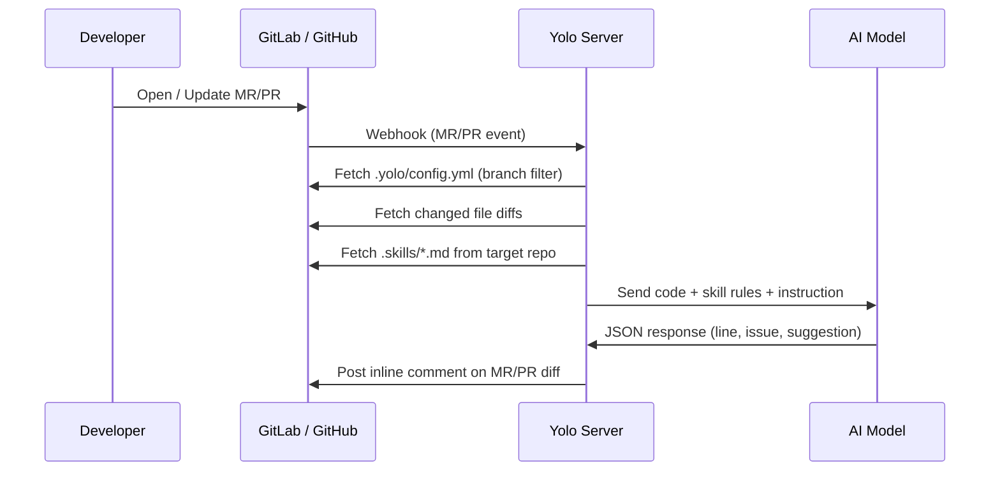

# Yolo AI Reviewer

**Automated AI code review for GitLab & GitHub — multi-platform, zero infrastructure required.**

Yolo listens to GitLab/GitHub webhooks, analyzes changed code using an AI model, and posts inline comments directly on the MR/PR diff — acting as an automated, tireless code reviewer.

## Features

- 🚀 **Interactive CLI Setup:** Generate configurations instantly using the built-in CLI prompt.
- 🧠 **AI Agnostic:** Supports OpenAI, Anthropic, Gemini, or any custom local LLMs (like Ollama).
- 🛡️ **Context-Aware Rules:** Reads your `.skills/` folder to apply repository-specific standards (e.g., security, clean code).
- 🔀 **Multi-Platform:** Full support for both **GitLab** Merge Requests and **GitHub** Pull Requests.
- 🌿 **Per-Repo Branch Filtering:** Configure which target branches to review via `.yolo/config.yml` inside each repo.
- 🔄 **Auto-Resolve Threads:** Automatically resolves old AI comments if you have fixed the code in subsequent commits.
- 🚫 **Anti-Spam:** Cryptographic hashing prevents the AI from posting duplicate comments on the same issues.
- ⚡ **Hot-Reloading Config:** Adjust system behaviors dynamically without restarting the server.

---

## How It Works



---

## Requirements

- [Bun](https://bun.sh) v1.0+
- GitLab or GitHub account
- An OpenAI-compatible AI proxy (`/v1/chat/completions` endpoint)

---

## Setup

### 1. Initialization

Run the interactive CLI to generate all config files automatically:

```bash
npx yolo init
```

Follow the prompts to configure your:
1. Git Platform (GitLab **or** GitHub)
2. Platform credentials & Webhook secret
3. Preferred AI provider (OpenAI, Anthropic, Gemini, or Custom)
4. AI parameters (Model, Temperature, Top-P)
5. AI Response Language (English or Indonesian)

Once finished, it automatically generates `.env`, `config.yml`, and `.yolo/config.yml`.

### 2. Run

```bash
bun dev
```

Server starts on `http://localhost:3000` (or the port you defined).

---

## Platform Setup

<details>
<summary><strong>🦊 GitLab — Webhook Setup</strong></summary>

1. Go to your GitLab project (or group).
2. Navigate to **Settings** → **Webhooks**.
3. Fill in the form:
   - **URL**: `https://your-server.com/webhook/gitlab`
   - **Secret token**: Paste the value of `GITLAB_WEBHOOK_SECRET` from your `.env`.
4. Under **Trigger**, uncheck *Push events* and check **Merge request events** only.
5. Click **Add webhook**.

You can verify by clicking **Test** → **Merge request events** in GitLab. A log should appear immediately in your Yolo server terminal.

</details>

<details>
<summary><strong>🐙 GitHub — Webhook Setup</strong></summary>

### Step 1: Create a Personal Access Token (PAT)

1. Go to **Settings** → **Developer settings** → **Personal access tokens** → **Tokens (classic)**.
2. Click **Generate new token (classic)**.
3. Give it a name (e.g., `YoloAIReviewer`) and select the **`repo`** scope.
4. Click **Generate token** and save it — this is your `GITHUB_TOKEN`.

### Step 2: Register the Webhook in Your Repo

1. Go to your repository → **Settings** → **Webhooks** → **Add webhook**.
2. Fill in the form:
   - **Payload URL**: `https://your-server.com/webhook/github`
   - **Content type**: `application/json`
   - **Secret**: A strong random string — same as `GITHUB_WEBHOOK_SECRET` in your `.env`.
3. Under **Which events?**, select **Let me select individual events** and check **Pull requests**.
4. Click **Add webhook**.

### Step 3: Testing

GitHub records all webhook deliveries. To re-trigger a past event:
1. Go to **Settings** → **Webhooks** → click your webhook URL.
2. Scroll to **Recent deliveries**, pick a delivery, and click **Redeliver**.

> **Local testing:** Use [ngrok](https://ngrok.com) or [Cloudflare Tunnel](https://developers.cloudflare.com/cloudflare-one/connections/connect-networks/) to expose your local server to the internet.

</details>

---

## Per-Repository Configuration (`.yolo/config.yml`)

Yolo supports per-repo configuration. Place a `.yolo/config.yml` file in the **root of the repository you want to review**. Yolo will automatically read this file when a PR/MR event arrives.

```text
your-project/
├── .yolo/
│   └── config.yml   ← per-repo Yolo settings
├── .skills/
│   ├── security.md
│   └── clean-code.md
└── src/
```

**Example `.yolo/config.yml`:**

```yaml
filters:
  # Only trigger Yolo when a PR/MR targets these branches.
  # Remove this block to review all target branches.
  target_branches:
    - main
    - develop
```

If `.yolo/config.yml` is missing, Yolo reviews all branches using the server's default configuration.

---

## Adding Skill Rules (`.skills/`)

Yolo fetches review guidelines directly from the repository being reviewed. Create a `.skills/` folder at the root of your target project:

```text
your-project/
└── .skills/
    ├── security.md
    ├── performance.md
    └── clean-code.md
```

Each `.md` file contains plain-text rules. All files are merged and sent to the AI as review standards.
If `.skills/` is empty or missing, Yolo falls back to general code review standards.

**Example `security.md`:**

```markdown
- Never hardcode credentials, tokens, or API keys
- Always validate and sanitize user input before processing
- Avoid exposing internal error details in API responses
```

---

## Configuration (`config.yml`)

The server-level `config.yml` controls global AI behavior. Generated automatically by `npx yolo init`.

```yaml
skillsPath: ".skills"
responseLanguage: "English"
features:
  autoResolve: true
  summaryComment: true
# ... and more
```

Changes to `config.yml` are picked up immediately while the server is running — no restart needed.

---

## Roadmap

- [x] **Priority 1: Foundation & Hardening**
  - Platform Abstraction Layer.
  - Interactive CLI Setup (`yolo init`).
  - Fail-Fast configuration validation.
  - Robust Error Handling & Standardized Logging.
- [x] **Priority 2: GitHub Integration & Multi-Platform Core**
  - GitHub REST API & GraphQL Provider.
  - Secure HMAC webhook verification.
  - Continuous review on push events (`synchronize`).
  - Per-repo configuration via `.yolo/config.yml`.
- [ ] **Priority 3: Community Growth & "Nice to Have"**
  - Smart notifications (Telegram/Slack alerts).
  - GitHub Actions zero-infrastructure mode.
  - Dockerization for easy deployment.
  - Gitea / Forgejo support.

---

## License

MIT
